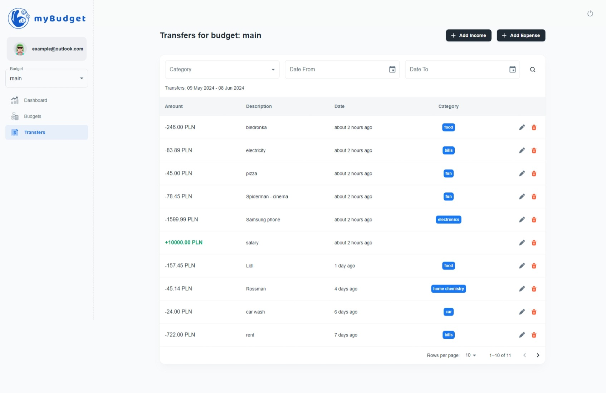

    
    

# myBudget

myBudget is an open-source web application to manage personal budgets.

> [!NOTE]
> This project is part of the ["100 Commits"](https://100commitow.pl/) competition.

## ✨ Features

- [x] Create a budget
- [x] List of budgets
- [x] Define a list of categories for each budget
- [x] Archive budget category to not use it anymore
- [x] Create a transfer (income or expense) in budget
- [x] Delete transfers
- [x] Assign a category to transfer
- [x] List of transfers with filtering by category and dates
- [x] Dashboard
  - [x] sum of incomes in one month
  - [x] sum of expenses in one month
  - [x] balance
  - [x] expenses to incomes ratio
  - [x] expenses grouped into categories
    - [x] bar chart
    - [x] pie chart
- [x] User registration
- [x] Workflow definition
- [ ] Integration with banking account

## Screenshots

### Transfers list

    

### Dashboard

    

## Architecture

    

The project consists of 3 components

1. <b>my-budget.frontend</b> - react app
1. <b>my-budget.api</b> - dotnet app
1. <b>my-budget.identity</b> - dotnet identity server. It implements the OpenIdConnect standard using OpenIddict library

## Demo

Application is available on [https://my-budget-app.azurewebsites.net](https://my-budget-app.azurewebsites.net)

* username: demo@mybudget.pl
* password: Demo!23

> [!WARNING]
> Application is hosted on Azure Service App Free Plan, so it is possible that you have to wait a moment for application start.

## Goals

The aim of the project is to test some solutions and concepts:

- DDD approach
- [implementing OpenIdConnect with OpenIddict](https://github.com/openiddict)
- [minimalAPI](https://learn.microsoft.com/en-us/aspnet/core/fundamentals/minimal-apis?view=aspnetcore-8.0)
- [TestContainers](https://testcontainers.com/)
- [MassTransit as mediator](https://masstransit.io/documentation/concepts/mediator)
- [Result pattern](https://www.milanjovanovic.tech/blog/functional-error-handling-in-dotnet-with-the-result-pattern)
- [Entity Framework Core Owned Entity Types](https://learn.microsoft.com/en-us/ef/core/modeling/owned-entities)
- [API testing](https://timdeschryver.dev/blog/how-to-test-your-csharp-web-api)
- github actions
- github container registry
